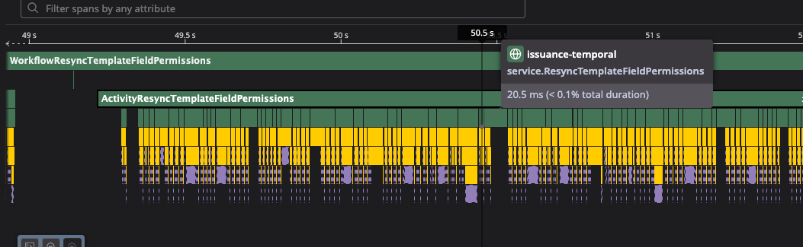

# DataDog Tracing Troubleshooting

## Overview

This repo serves as a minimal reproduction of a DataDog tracing issue that we experience
when using the Temporal Go SDK and dd-trace-go. The summary of the issue is as follows:

1. We have a Temporal Workflow that is instrumented with DataDog tracing.
2. This workflow performs a "fan-out" operation across an entire database table for this demo's purpose
3. Each "entity" is producing a message to the 'EntityUpserted' topic in Kafka
4. Downstream services should consume this message and process it, but this is separate from our issue
5. The issue occurs such that after the first Activity Fanout page, no further tracing spans
    are available in DataDog's UI

## Reproduction Steps

This repo has a Docker Compose file to spin up the necessary dependencies for the Go app (without DataDog):
   - Temporal Server
   - Postgres
   - Kafka
```shell
docker-compose up .
```

As such, this can be deployed to a K8s cluster with DataDog's Agent already installed, and
environment variables modified for the app in `cmd/worker/main.go` to be configured.

1. Deploy the `worker` application with configurations to connect to a Kafka cluster, Postgres,
 and Temporal server.
2. In Temporal (or use the `starter` application), start a workflow with the following parameters:
- TaskQueue: `TaskQueueObjectFanout`
- Workflow Type: `WorkflowObjectFanout`
- No payload required
3. In DataDog APM, you should see several spans for the service `fanout-worker` similar to the linked
image:


### Building the Docker Image

```shell
docker buildx build \
  --platform linux/amd64 \
  -t datadog-tracing-issue/worker:latest \
  --target=worker \
  .
```

This will build the worker image, running in `alpine`, with the `musl` libc for
`confluent-kafka-go` to work.

## Notes

### DataDog Tracing

We have the following instrumentations in place:
- `dd-trace-go` for the app
- `go.temporal.io/sdk/contrib/datadog` for the Temporal SDK
- `gopkg.in/DataDog/dd-trace-go.v1` with the following contributions:
  - `confluent-kafka-go/kafka.v2` for the Kafka producer
  - `database/sql` for wrapping the pgx driver
  - `gorm.io/gorm.v1` for wrapping the gorm DB library
- Manual instrumentation in `pkg/fanout/tracing` to wrap the "service" layer and the "repository" layer

The given environment variables are set for deployments:

```shell
TRACE_SAMPLE=1.0
DD_DATA_STREAMS_ENABLED=true
DD_DBM_PROPAGATION_MODE=full
DD_TRACE_REMOVE_INTEGRATION_SERVICE_NAMES_ENABLED=true
```

### CGO

Due to Confluent's Kafka library, we need to use CGO to run. We've opted to use alpine for our runtime
base image, which results in a difference of using traditional `libc` vs `musl` libc. This explains the
usage in the Dockerfile to have `GOFLAGS="-tags=musl"` at build time. Because of this, running the
application on an arm64 architecture may have issues, compared to running in an x86_64 architecture.
